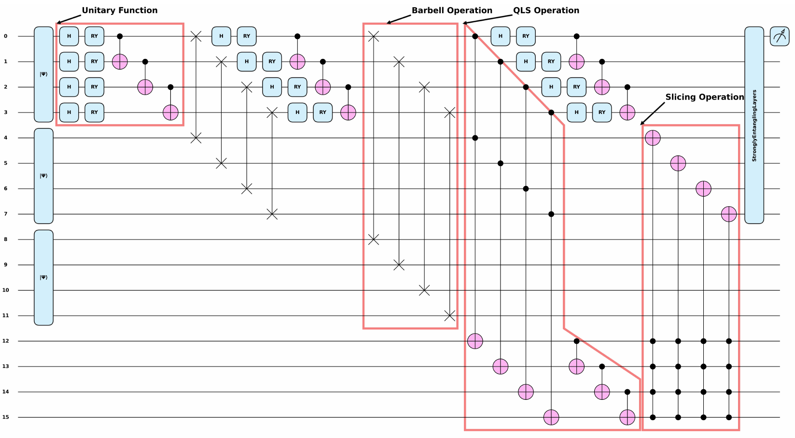
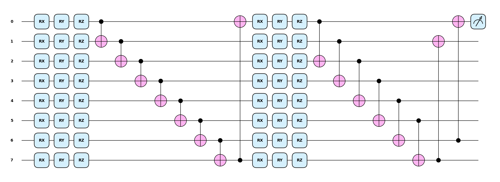
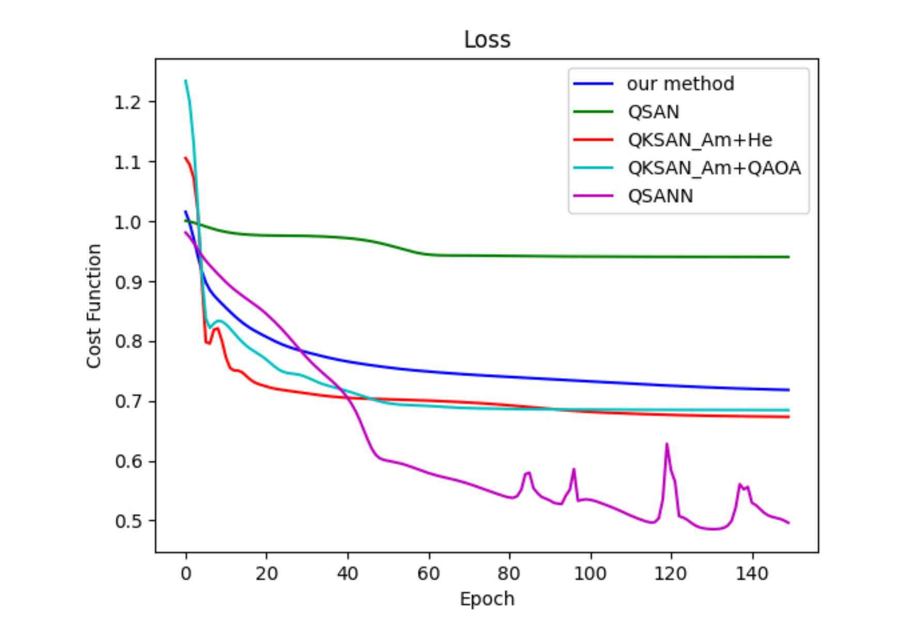
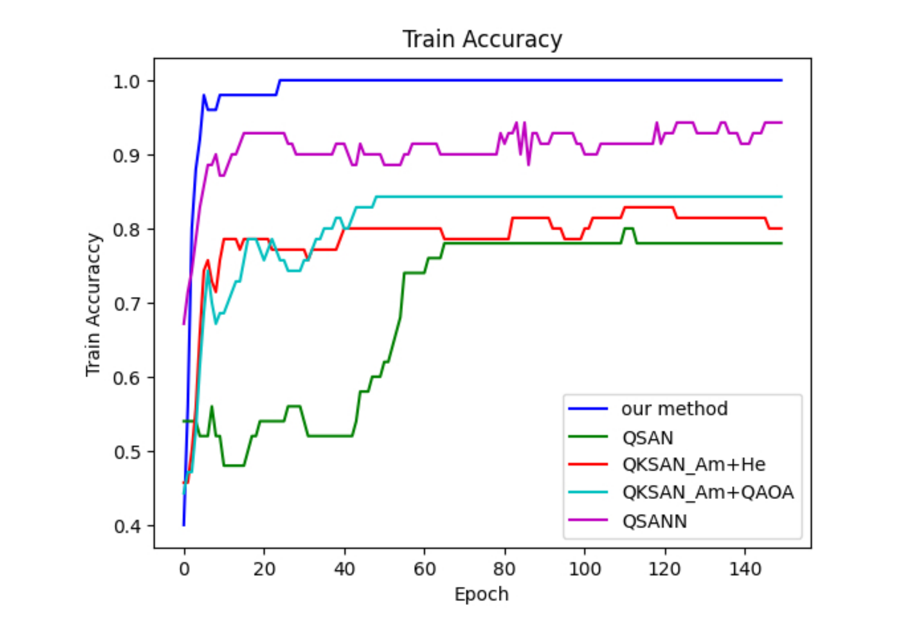
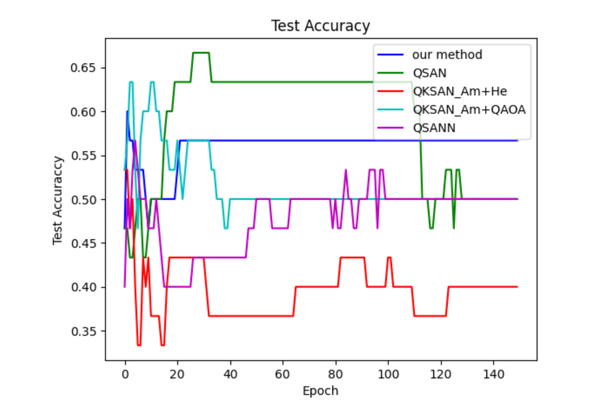

# Efficient Circuit Classifier Design for Enhancing Quantum Self-Attention in Vision Transformers

**Quang-Huyen Tran**, **Yu-Han Lin** — *Dept. of Computer Science and Information Engineering, National Chung Cheng University, Chiayi, Taiwan*
**Hanh T. M. Tran**, **Duy-Tuan Dao** — *Faculty of Electronics and Telecommunication Engineering, Danang University of Science and Technology, Vietnam*
**Van-Linh Nguyen** — *National Chung Cheng University, Chiayi, Taiwan*

This repository contains the official implementation of the paper
[*Efficient Circuit Classifier Design for Enhancing Quantum Self-Attention in Vision Transformers*](https://ieeexplore.ieee.org/document/11591004/authors#authors).

---

## Overview

Quantum self-attention is a promising, GPU-free alternative to the classical self-attention mechanism
that powers Transformer models. However, early quantum self-attention architectures struggle with
classification tasks: they rely on directly measuring only a few output qubits, which severely limits
their ability to separate class-specific features.

In this work we show that treating the **Quantum Self-Attention Network (QSAN)** as a *feature
extractor* and appending a **strongly entangling-layers circuit classifier** substantially improves
classification performance — reaching **100% training / 56% testing accuracy** on the MC (QNLP)
dataset and outperforming state-of-the-art quantum self-attention baselines by **10–23%**.

## Abstract

Quantum self-attention is a promising approach to replace traditional self-attention mechanisms in
classical deep learning, which often require a massive number of GPUs for training. Although several
early studies have proposed quantum self-attention architectures, these models often struggle with
classification tasks in vision transformers. In this study, we address this limitation by enhancing
quantum self-attention through integration with circuit classifier design and, crucially, by optimizing
the number of strong entangling layers. Evaluation results show that incorporating an optimal number of
entangling layers substantially improves classification performance, outperforming models that rely
solely on directly measured quantum self-attention. Experiments on downscaled MNIST and MC datasets
reveal that the nature of the input data has minimal impact on the final outcomes. Notably, testing
accuracy reaches **56%** when using **10–16 strong entangling layers**, highlighting the critical role
of entanglement in model performance. For SOTA comparison, we replicate existing quantum self-attention
methods and demonstrate that our model consistently achieves **10–23% better performance**. Additionally,
we compare different optimizers and find that **Nesterov Momentum** delivers the most effective
convergence for our architecture.

## Contributions

- **Improve QSAN classification** by integrating the self-attention mechanism of QSAN with the
  expressive power of strong entangling layers. This combination enables a fully quantum model that
  both captures complex dependencies in the input data and performs effective classification entirely
  on quantum hardware.
- **Systematically study entanglement depth** by varying the number of strong entangling layers (1–18)
  to uncover the relationship between entanglement depth and learning performance in quantum neural
  networks.
- **Evaluate five optimizers** (Adam, Adagrad, Gradient Descent, Momentum, Nesterov Momentum) to
  identify which optimizer most effectively enhances convergence and overall model performance in
  quantum machine learning (QML) training.

## Methodology

The proposed model uses QSAN as a feature extractor followed by a strong entangling layers classifier.
The pipeline (Algorithm 1 in the paper) is:

1. **Amplitude Encoding** — map the classical input `x` into quantum states
   `|ψ_m⟩ = Σᵢ xᵢ |i⟩` (an `N`-dimensional input requires `⌈log₂N⌉` qubits per register).
2. **Unitary Function** — compute trainable Query/Key/Value states
   `Q = Uq(θq)|ψ⟩`, `K = Uk(θk)|ψ⟩`, `V = Uv(θv)|ψ⟩`.
3. **Barbell Operation** — a four-swap procedure that loads the `Q`, `K`, `V` states into their
   respective registers.
4. **Quantum Logic Similarity (QLS)** — Toffoli + CNOT gates compute the similarity between `Q` and `K`
   (the quantum analogue of the `Q·Kᵀ` attention score).
5. **Slicing operation** — multi-controlled quantum gates compress information and capture the presence
   of `Q` and the QLS score.
6. **Circuit classifier** — the measured features are fed into **strongly entangling layers**
   (introduced by Schuld et al., implemented in PennyLane/Qiskit), which act as the classifier.
7. **Measurement** — the expectation value `⟨Z₀⟩` is used to give the prediction.



*Figure 1: The proposed model — QSAN feature extractor followed by a strongly entangling-layers circuit classifier.*



*Figure 2: Strong entangling layers ansatz used as the quantum classifier.*

### Quantum resource requirements

Given a data dimension `D`, each register requires `N_register = log₂D` qubits (amplitude encoding).
The circuit uses four registers (Query, Key, Value, QLS result), so the total qubit count is:

```
Q_total = 4 · N_register = 4 · log₂(D)
```

For the 16-dimensional inputs used here this corresponds to a simulated 16-qubit quantum computer.

### Baseline models compared

| Model | Qubits | Depth | Classification Method | Quantum Scope | Classifiability | Train / Test Acc. | QSA Compute Method |
| --- | --- | --- | --- | --- | --- | --- | --- |
| QSAN (Shi et al.) | 3n | 9 | Direct Measurement | Full | Limited | 72% / 40% | Quantum Logic Similarity |
| QKSAN (Zhao et al.) | 2n | 4 | QAOA-based Classifier | Full | Low | 76% / 42% | Quantum Kernel Self-Attention |
| QSANN (Li et al.) | 3n | 3 | Variational Classifier | Partial | Moderate | 92% / 53% | Gaussian Project |
| QSANM (Zheng et al.) | 3n | 4 | Direct Measurement | Full | Low | 78% / 50% | Strongly Entangled Quantum Circuits |
| **Ours** | **3n** | **9** | **Strong Entangling Layer** | **Full** | **High** | **100% / 56%** | **Quantum Logic Similarity** |

## Datasets

| Dataset | Description | Source |
| --- | --- | --- |
| **MC (QNLP)** | 130 four-word sentences about IT or non-IT (cooking) topics: 70 train / 30 dev / 30 test. Standard benchmark for Quantum Natural Language Processing (QNLP). | Lorenz et al., "QNLP in practice" |
| **Downscaled MNIST** | Original MNIST compressed with PCA into 19 versions of dimension `d = {2, …, 20}`. Binary task: distinguish digits **3 vs 5** (labels `+1` / `-1`). 11,552 train + 1,902 test samples. We use the `d = 16` version with 50 train and 30 test samples. | [PennyLane downscaled MNIST](https://pennylane.ai/datasets/downscaled-mnist) |

## Experimental Setup

All experiments used PennyLane for simulation with the MSE loss and a learning rate of `α = 0.5`
(lower rates slow convergence but preserve the performance trend).

| Setting | Value |
| --- | --- |
| Number of epochs | 150 |
| Primary optimizer | Nesterov Momentum |
| Dataset | MC |
| Learning rate | 0.5 |
| Train / Dev / Test size | 50 / 30 / 30 |
| Hardware | Kaggle CPU-only, Intel Xeon @ 2.20 GHz, 32 GB RAM |
| Simulated device | 16-qubit (16-dimensional input, amplitude encoding) |

## Key Results

### 1. Optimizer comparison (MC dataset, 150 epochs, lr = 0.5)

| Optimizer | Epochs to Converge | Final Loss | Running Time (s) | Loss Stability |
| --- | --- | --- | --- | --- |
| Adam | 40 | 0.68 | 160 | Unstable |
| Gradient Descent | 20 | 0.77 | 180 | Stable |
| Momentum | 20 | 0.70 | 150 | Stable |
| Adagrad | 20 | 0.70 | 140 | Unstable |
| **Nesterov Momentum** | **10** | **0.71** | **120** | **Stable** |

**Nesterov Momentum converges fastest (10 epochs, ~120 s) and most stably.** Adam — despite being the
usual choice in classical ML — needs ~4× more epochs and is unstable during training.

### 2. Effect of the number of strong entangling layers

| Layers | Best Train Acc. | Last Train Acc. | Final Test Acc. |
| --- | --- | --- | --- |
| 1 | 82% | 82% | 60% |
| 2 | 78% | 80% | 53% |
| 3 | 96% | 94% | 56% |
| 4 | 92% | 90% | 53% |
| 5 | 92% | 90% | 53% |
| 6 | 90% | 90% | 43% |
| 7 | 94% | 92% | 53% |
| 8 | 98% | 98% | 66% |
| 9 | 96% | 96% | 66% |
| 10 | 96% | 94% | 53% |
| 11 | 100% | 100% | 40% |
| 12 | 100% | 96% | 30% |
| 13 | 100% | 100% | 50% |
| 14 | 100% | 100% | 40% |
| 15 | 92% | 92% | 56% |
| 16 | 96% | 96% | 36% |
| 17 | 100% | 100% | 30% |
| 18 | 94% | 94% | 46% |

**More layers do not always help.** The optimal range is **10–16 layers**, beyond which
over/under-fitting and the *barren plateau* phenomenon (randomly initialized quantum circuits) degrade
performance.

### 3. Comparison with state-of-the-art models

| Dataset | Split | QSAN | QKSAN (Am+He) | QKSAN (Am+QAOA) | QSANN | **Ours** |
| --- | --- | --- | --- | --- | --- | --- |
| MC | Train | 78% | 80% | 85% | 92% | **100%** |
| MC | Test | 50% | 40% | 50% | 50% | **56%** |
| MNIST | Train | 72% | 76% | 74% | – | **100%** |
| MNIST | Test | 40% | 42% | **50%** | – | 40% |

Our model achieves at least **10% higher training accuracy** than all baselines on both QML (MNIST) and
QNLP (MC) benchmarks under identical settings. Test accuracy differences are limited by the small
evaluation sets; the MC result (56%) is the highest among all compared models.



*Figure 3: Training cost curves — our method converges to a lower loss than the baselines.*



*Figure 4: Training accuracy curves — our method reaches 100% training accuracy.*



*Figure 5: Testing accuracy curves — our method achieves the highest test accuracy (56%).*

## Repository Structure

```
.
├── comparison_with_mc_datasets/      # Experiments on the MC (QNLP) dataset
│   ├── our_method_with_15_layers.ipynb   # Proposed model: QSAN + 15 strong entangling layers (Nesterov)
│   ├── qksan-amhe-nlp.ipynb              # Baseline: QKSAN (Amplitude encoding + Hardware-efficient)
│   ├── qksan-amqaoa-nlp.ipynb            # Baseline: QKSAN (Amplitude encoding + QAOA)
│   └── QSANN.ipynb                       # Baseline: QSANN (Gaussian-project quantum self-attention)
├── comparison_with_mnist_datasets/   # Same baselines evaluated on Downscaled MNIST
│   ├── qksan-amhe-mnist.ipynb
│   └── qksan-amqaoa-mnist.ipynb
└── different_optmizers/              # Optimizer comparison on the proposed model (MC dataset)
    ├── adam_optimizer.ipynb
    ├── adagrad_optimizer.ipynb
    ├── gradient_descent_optimizer.ipynb
    └── momentum_optimizer.ipynb
└── figures/                          # Figures used in this README
    ├── proposed_model.png
    ├── strong_entangling_layers.png
    ├── results_cost.png
    ├── results_train_acc.png
    └── results_test_acc.png
```

> Nesterov Momentum results are produced by `our_method_with_15_layers.ipynb`
> (and `qsann`/`qksan-*` notebooks for baselines).

## Requirements

The notebooks run on **CPU-only** (e.g., Kaggle) and require:

- Python 3.x
- [PennyLane](https://pennylane.ai) (quantum circuit simulation)
- TensorFlow (MC dataset word embedding)
- Matplotlib (plotting)

```bash
pip install pennylane tensorflow matplotlib
```

## Usage / Reproduction

1. **Install the dependencies** (above).
2. **Download the MC dataset** from Kaggle
   (`MC and RP dataset for quantum computing QNLP`) and place
   `mc_train_data.txt`, `mc_dev_data.txt`, `mc_test_data.txt` at
   `/kaggle/input/mc-and-rp-dataset-for-quantum-computing-qnlp/` (or edit the path in the notebook).
3. **Open and run** the notebook that matches the experiment you want to reproduce:

| Experiment | Notebook |
| --- | --- |
| Proposed model (QSAN + 15 layers, MC) | `comparison_with_mc_datasets/our_method_with_15_layers.ipynb` |
| QKSAN (Am+He / Am+QAOA) on MC | `comparison_with_mc_datasets/qksan-amhe-nlp.ipynb`, `qksan-amqaoa-nlp.ipynb` |
| QSANN on MC | `comparison_with_mc_datasets/QSANN.ipynb` |
| QKSAN on MNIST | `comparison_with_mnist_datasets/qksan-amhe-mnist.ipynb`, `qksan-amqaoa-mnist.ipynb` |
| Optimizer study (Adam / Adagrad / GD / Momentum) | `different_optmizers/adam_optimizer.ipynb`, `adagrad_optimizer.ipynb`, `gradient_descent_optimizer.ipynb`, `momentum_optimizer.ipynb` |

The Downscaled MNIST dataset is fetched automatically by PennyLane
(`qml.data.load("other", name="downscaled-mnist")`).

## Authors

- **Quang-Huyen Tran** — National Chung Cheng University, Taiwan
- **Yu-Han Lin** — National Chung Cheng University, Taiwan
- **Hanh T. M. Tran** — Danang University of Science and Technology, Vietnam
- **Duy-Tuan Dao** — Danang University of Science and Technology, Vietnam
- **Van-Linh Nguyen** — National Chung Cheng University, Taiwan

## Citation

If you use this code in your research, please cite:

```bibtex
@article{tran2025efficient,
  title   = {Efficient Circuit Classifier Design for Enhancing Quantum Self-Attention in Vision Transformers},
  author  = {Tran, Quang-Huyen and Lin, Yu-Han and Tran, Hanh Thi Minh and Dao, Duy-Tuan and Nguyen, Van-Linh},
  journal = {IEEE},
  year    = {2025},
  url     = {https://ieeexplore.ieee.org/document/11591004}
}
```

## References

Key works reproduced or compared against:

1. **J. Shi, R.-X. Zhao, W. Wang, S. Zhang, and X. Li**, *QSAN: A Near-Term Achievable Quantum
   Self-Attention Network*, IEEE TNNLS, 2024.
2. **R.-X. Zhao, J. Shi, and X. Li**, *QKSAN: A Quantum Kernel Self-Attention Network*,
   IEEE TPAMI, 2024.
3. **G. Li, X. Zhao, and X. Wang**, *Quantum Self-Attention Neural Networks for Text Classification*,
   Science China Information Sciences, vol. 67, 2024.
4. **J. Zheng, Q. Gao, and Z. Miao**, *Design of a Quantum Self-Attention Neural Network on Quantum
   Circuits*, IEEE SMC, 2023.
5. **M. Schuld, A. Bocharov, K. Svore, and N. Wiebe**, *Circuit-Centric Quantum Classifiers*, 2018.
6. **R. Lorenz, A. Pearson, K. Meichanetzidis, D. Kartsaklis, and B. Coecke**, *QNLP in Practice:
   Running Compositional Models of Meaning on a Quantum Computer*, JAIR, vol. 76, 2023.
7. **J. R. McClean et al.**, *Barren Plateaus in Quantum Neural Network Training Landscapes*,
   Nature Communications, vol. 9, 2018.
8. **A. Vaswani et al.**, *Attention Is All You Need*, NeurIPS, 2017.

## License

This project is for research purposes. Please contact the authors for further details.
